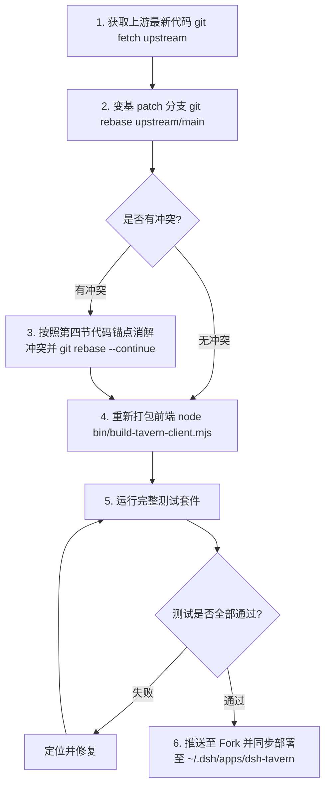

# DSH Tavern - Agent 自动同步与 Patch 维护指南

> **文档定位**：本指南专为 AI 编码助手（Agent）编写。当用户发出类似“*上游更新了，请帮我同步并解决冲突，重新应用 Patch*”的指令时，Agent 应严格遵守本指南定义的规范与步骤自动执行。

---

## 一、项目架构与分支拓扑

- **上游主仓（upstream）**：`https://github.com/flizzywine/dsh-tavern.git`
- **个人仓库（origin）**：`git@github.com:Beriholic/dsh-tavern.git`
- **主分支（main）**：必须与 `upstream/main` 保持严格一致，不包含任何定制提交。
- **补丁分支（patch）**：承载定制功能的独立功能分支，始终变基（Rebase）在最新的 `upstream/main` 顶端。
- **本地运行环境**：`~/.dsh/apps/dsh-tavern`（被 `~/.dsh/profiles/tavern` 软链引用）。

---

## 二、Patch 核心功能规范

本 Patch 分支承载两个核心定制功能：

### 1. 全局独立世界书
**核心业务目标**：允许独立世界书（Standalone WorldBook）被标记为全局生效，并在会话中与人物卡的专属世界书无缝合成为复合世界书（Composite WorldBook）。

**关键业务不变式（Invariants，不可破坏）**：
1. **酒馆标准排序（Tavern Order）**：复合世界书中的所有条目必须按 `order`（降序）及 `displayIndex`（升序）排序，并分配确定性的连续自增 UID（0, 1, 2...）。
2. **专属世界书写回隔离**：角色助手（TavernHelper / 脚本）更新条目时，若处于复合世界书模式，只能写回角色专属世界书或会话本地快照，**严禁写回全局世界书**。
3. **开局快照去重**：游玩会话已保存 `openingWorldbookSnapshot` 时，不得重复将磁盘上的全局世界书合并进去，确保局内数据与冷却时间线的自洽性。
4. **前端测试用例兼容**：在 `CardFieldsPanel` 中，世界书下拉框的默认占位文本必须为 `"选择世界书"`（不可随意改为“选择专属世界书”），以通过 `tests/worldbook-choice-label.test.mjs` 测试。

### 2. MVU 变量结算思考强度单独设置
**核心业务目标**：允许在酒馆全局设置中单独配置 MVU 变量更新时的模型推理/思考强度（`reasoningEffort`），将其与前台剧情模型或后台候选生成的高思考预算解耦。推荐设为“关闭思考（off）”，大幅加快变量结算速度并避免空回复或格式紊乱。

**关键业务不变式（Invariants，不可破坏）**：
1. **推理强度归一化（Reasoning Effort Normalization）**：仅接受 `off`、`low`、`medium`、`high` 四个标准值；空值、`inherit` 或其他非法值一律归一化为 `null`（代表跟随后台模型配置）。
2. **单轮请求级动态覆盖（Per-Request Dynamic Override）**：在 `background-agent-task.js` 的 `childCtx.on('agent/request')` 钩子中，根据当前任务的 `selection.reasoningEffort` 动态覆盖该次 LLM 请求的推理强度。严禁为不同任务销毁重建后台常驻 Agent 会话。
3. **全局设置动态即时生效**：在酒馆设置中保存后，即时对后续所有轮次的变量结算生效，无需重启游戏或重新开局。

---

## 三、Agent 自动化执行标准流程（SOP）

当收到用户的同步指令时，Agent 请按顺序执行以下 6 个步骤：



### 步骤 1：同步上游主干
```bash
git fetch upstream
git checkout main
git merge --ff-only upstream/main
git push origin main
```

### 步骤 2：变基 Patch 分支
```bash
git checkout patch
git rebase upstream/main
```
- 若发生冲突，进入 **第四节：冲突消解指南**。解决后执行：
  ```bash
  git add <冲突文件>
  git rebase --continue
  ```

### 步骤 3：重新构建客户端
```bash
node bin/build-tavern-client.mjs
node bin/build-tavern-client.mjs --check
```

### 步骤 4：自动化测试验证
必须确保以下测试集 100% 通过（pass 100+，fail 0）：
```bash
node --test tests/worldbook-library.test.mjs \
            tests/worldbook-choice-label.test.mjs \
            tests/worldbook-recall.test.mjs \
            tests/worldbook-resource.test.mjs \
            tests/frame-worldbook-facade.test.mjs \
            tests/tavern-helper-worldbook.test.mjs \
            tests/scene-worldbook.test.mjs \
            tests/conversation-initialization.test.mjs \
            tests/opening-preparation.test.mjs \
            tests/background-model-selection.test.mjs \
            tests/tavern-settings.test.mjs \
            tests/mvu-background-settlement.test.mjs
```

### 步骤 5：推送到 Fork 仓库
```bash
git push --force-with-lease origin patch
```

### 步骤 6：热同步到本地运行环境
```bash
rsync -av --exclude='.git' --exclude='node_modules' \
  /Users/beriholic/Downloads/dsh-tavern/ /Users/beriholic/.dsh/apps/dsh-tavern/

pnpm --dir /Users/beriholic/.dsh/apps/dsh-tavern install --frozen-lockfile
pnpm --dir /Users/beriholic/.dsh/profiles/tavern install
```

---

## 四、Patch 核心修改点与冲突消解指南（代码锚点）

如果在 `git rebase upstream/main` 时出现冲突，请对照以下两部分功能的代码锚点进行合并：

---

### A. 全局独立世界书代码锚点

#### 1. `tavern-plugin/lib/domain/file-resources.js`
- **定位**：`createFileResourceStore` 内部。
- **锚点内容**：
  - `globalWorldBooksPath = path.join(dataRoot, '.global-worldbooks.json')`
  - `readGlobalWorldBooks()`, `writeGlobalWorldBooks()`, `listGlobalWorldBooks()`, `setGlobalWorldBook(worldBookPath, enabled)`
  - 在 `remove(relative)` 中添加：如果被删资源是世界书，调用 `setGlobalWorldBook(normalized, false)`
  - 在 `renameResource(relative, requestedName)` 中同步改名
  - 返回对象导出 `listGlobalWorldBooks` 和 `setGlobalWorldBook`

#### 2. `tavern-plugin/lib/domain/worldbook-library.js`
- **定位**：`createWorldBookLibrary` 内部。
- **锚点内容**：
  - `listGlobal()` / `isGlobal(path)` / `toggleGlobal(path, enabled)`
  - `catalog()`：standalone 项目返回中包含 `global: globalSet.has(record.source.path)`，返回对象包含 `globalPaths: globalList`
  - `get()`：返回对象包含 `global: isGlob`
  - `compositeWorldBookRecords(cardRecord, globalRecords)`：抽取 entries，按 `order` 降序与 `displayIndex` 升序排序，设置新 uid
  - `bound(cardPath, card, chat)`：
    - 若 `chat?.openingWorldbookSnapshot` 存在且源中已包含该全局路径，跳过；
    - 否则读取 `globalPaths`，若存在则返回 `compositeWorldBookRecords(cardRecord, globalRecords)`
  - `associations()`：`if (occupied.length && !relations.global)` 免除全局世界书的冲突报错
  - `remove(path)`：删除前清理全局标记
  - 导出 `listGlobal, toggleGlobal, isGlobal`

#### 3. `tavern-plugin/lib/domain/tavern-script-host-adapter.js`
- **定位**：`updateBoundWorldbook`、`exportBoundWorldbook` 与 `worldbookKey`。
- **锚点内容**：
  ```javascript
  // updateBoundWorldbook
  if (!resolved.record.localChatId) {
    const targetSource = resolved.record.source.kind === 'composite'
      ? (resolved.record.cardRecord ? resolved.record.cardRecord.source : null)
      : resolved.record.source
    if (!targetSource) throw new Error('全局复合世界书不支持直接回写')
    return nativeDocument === undefined
      ? await options.worldBooks.update(targetSource, request)
      : await options.worldBooks.replaceNative(targetSource, nativeDocument)
  }

  // exportBoundWorldbook
  return (record.localChatId || record.source.kind === 'composite')
    ? exportSillyTavernWorldBook(record.document)
    : (await options.worldBooks.export(record.source)).document

  // worldbookKey
  const source = record.source.kind === 'composite' && record.cardRecord ? record.cardRecord.source : record.source
  if (source.kind === 'composite') {
    return 'composite:' + (source.sources || []).map(s => s.kind + ':' + (s.cardPath || s.path)).join(';')
  }
  ```

#### 4. `tavern-plugin/lib/index.js`（全局世界书 RPC 与装配）
- **定位**：`createWorldBookLibrary` 选项注入与 RPC 派发。
- **锚点内容**：
  - `resources` 参数传入：
    ```javascript
    listGlobal: async function () { return await fileResources.listGlobalWorldBooks() },
    setGlobal: async function (path, enabled) { return await fileResources.setGlobalWorldBook(path, enabled) }
    ```
  - RPC 派发新增：
    ```javascript
    case 'toggleGlobalWorldBook': return await worldBooks.toggleGlobal(args && args.path, args && args.enabled)
    case 'listGlobalWorldBooks': return { globalPaths: await worldBooks.listGlobal() }
    ```

#### 5. `tavern-plugin/src/client/main.js`（全局世界书 UI）
- **定位**：
  - `WorldBookEditor`：子标题在 `props.record.global` 为真时显示 `· 全局生效`。
  - `WorldBookLibraryTab`：
    - 新增 `toggleGlobal` 函数调用 `toggleGlobalWorldBook`；
    - `bindingPanel` 中展示全局生效状态切换按钮与说明；
    - 独立世界书列表卡片行（`row(item)`）展示 `[全局生效]` 徽章。
  - `CardFieldsPanel`：
    - `globalWorldBooks` 直接派生自 `(availableWorldBooks || []).filter(item => Boolean(item && item.global))`；
    - 渲染 `🌐 全局生效世界书（自动应用于所有人物卡）` 横幅；
    - 下拉框选项默认文本**必须保持**为 `"选择世界书"`。

#### 6. `tests/worldbook-library.test.mjs`
- **定位**：`harness()` 与测试尾部。
- **锚点内容**：
  - `harness()` 的 `resources` 中实现 `listGlobal` 与 `setGlobal`；
  - 包含 3 个专项测试：
    1. `独立世界书支持标记为全局生效与取消，并在目录和关联查询中体现`
    2. `全局世界书与人物卡世界书自动合成为复合世界书并按优先级排序`
    3. `存在开局快照时复合世界书不重复叠加全局条目`

---

### B. MVU 变量结算思考强度代码锚点

#### 7. `tavern-plugin/lib/domain/background-model-selection.js`
- **定位**：`VALID_REASONING_EFFORTS`、`normalizeReasoningEffort`、`normalizeBackgroundModel`、`resolveMvuSelection`。
- **锚点内容**：
  ```javascript
  export const VALID_REASONING_EFFORTS = Object.freeze(['off', 'low', 'medium', 'high'])

  export function normalizeReasoningEffort(value) {
    if (typeof value !== 'string') return null
    const normalized = value.trim().toLowerCase()
    return VALID_REASONING_EFFORTS.includes(normalized) ? normalized : null
  }
  ```
  - `normalizeBackgroundModel` 中保留 `input.reasoningEffort`：
    ```javascript
    const reasoningEffort = normalizeReasoningEffort(input.reasoningEffort)
    if (reasoningEffort !== null) result.reasoningEffort = reasoningEffort
    ```
  - 新增 `resolveMvuSelection(baseSelection, mvuReasoningEffort)`：
    ```javascript
    export function resolveMvuSelection(baseSelection, mvuReasoningEffort) {
      if (baseSelection === null || typeof baseSelection !== 'object') return null
      const effort = normalizeReasoningEffort(mvuReasoningEffort)
      if (effort === null) return baseSelection
      return Object.assign({}, baseSelection, { reasoningEffort: effort })
    }
    ```

#### 8. `tavern-plugin/lib/domain/tavern-settings.js`
- **定位**：`applyTavernSettingsPatch` 与 `presentTavernSettings`。
- **锚点内容**：
  - `import { normalizeBackgroundModel, normalizeReasoningEffort } from './background-model-selection.js'`
  - `applyTavernSettingsPatch` 中添加：
    ```javascript
    if (Object.prototype.hasOwnProperty.call(input, 'mvuReasoningEffort')) {
      const effort = normalizeReasoningEffort(input.mvuReasoningEffort)
      if (effort === null) delete next.mvuReasoningEffort
      else next.mvuReasoningEffort = effort
    }
    ```
  - `presentTavernSettings` 中返回：
    ```javascript
    mvuReasoningEffort: normalizeReasoningEffort(object(document).mvuReasoningEffort),
    ```

#### 9. `tavern-plugin/lib/background-agent-task.js`
- **定位**：`setupFor` 内部 `childCtx.on('agent/request')` 钩子。
- **锚点内容**：
  ```javascript
  childCtx.on('agent/request', async function (_payload, next) {
    const input = state.input || {}
    const request = await next()
    const temperature = state.characterDesignStage
      ? state.characterDesignStage.temperature(input.temperature)
      : input.temperature
    const overrides = {}
    if (typeof temperature === 'number' && input.selection && input.selection.provider !== 'openai-codex') {
      overrides.temperature = temperature
    }
    if (input.selection && typeof input.selection.reasoningEffort === 'string' && input.selection.reasoningEffort.trim() !== '') {
      overrides.reasoningEffort = input.selection.reasoningEffort.trim()
    }
    return Object.keys(overrides).length > 0 ? Object.assign({}, request, overrides) : request
  })
  ```

#### 10. `tavern-plugin/lib/index.js`（MVU 结算模型选择注入）
- **定位**：导入与 `queueSettlement` / `mvuSettlement.settleVariables` 调用处。
- **锚点内容**：
  - 导入：`import { resolveChatBackgroundModel, resolveMvuSelection } from './domain/background-model-selection.js'`
  - 读取设置并在结算时覆盖：
    ```javascript
    const tavernSettings = await readTavernSettings()
    const backgroundTasksSettings = tavernSettings.backgroundTasks
    ...
    const baseSelection = backgroundModelSelection(snapshot)
    if (baseSelection === null) throw new Error('没有可用的模型配置，请先在当前会话的模型选择器中选择模型')
    const selection = resolveMvuSelection(baseSelection, snapshot.mvuReasoningEffort || tavernSettings.mvuReasoningEffort)
    mvuResult = await mvuSettlement.settleVariables({
      ...settlementInput,
      system: backgroundTasksSettings.posture ? runtimePrompt('posture-settlement') : '',
      selection,
      persistentSessionId: backgroundSessionId,
      signal
    })
    ```

#### 11. `tavern-plugin/src/client/main.js`（变量结算思考强度 UI）
- **定位**：`TavernSettingsSection` 组件内部。
- **锚点内容**：
  - 初始 `state` 包含 `mvuReasoningEffort: null`；
  - `getTavernSettings` 回调与 `setBackgroundModel` 中维护 `mvuReasoningEffort` 状态；
  - 新增 `setMvuReasoningEffort(value)` 提交 patch 并派发变化事件；
  - 在“后台结算”区块下渲染“变量结算思考强度”行，绑定选项：`跟随后台模型（默认）`、`关闭思考（推荐）`、`低（Low）`、`中（Medium）`、`高（High）`。

---

## 五、用户可直接唤起 Agent 的提示词模板

当上游发生更新时，用户只需将以下一句话发送给 Agent：

> **“上游仓库更新了，请按照 `docs/agent-patch-guide.md` 中的规范，帮我将 patch 分支变基（rebase）到最新的 upstream/main，解决冲突并执行构建和测试，最后同步到本地环境。”**

